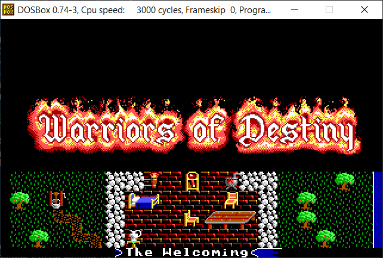
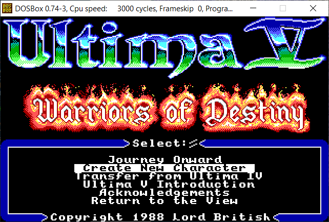
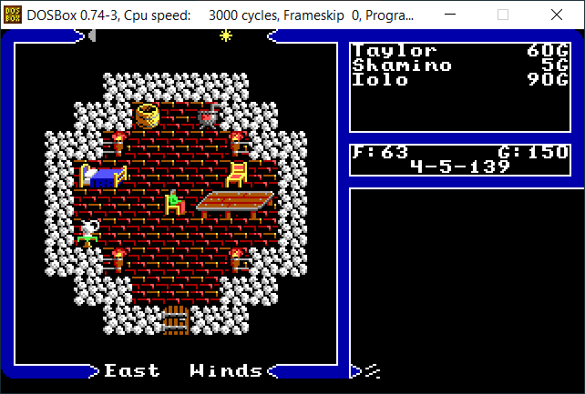
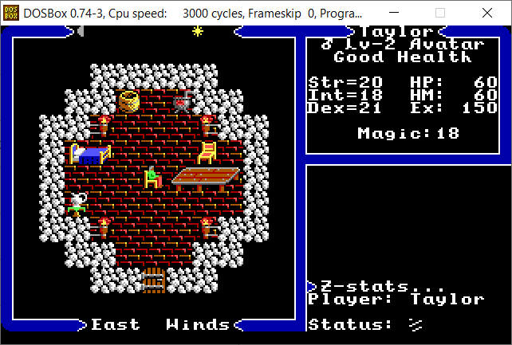
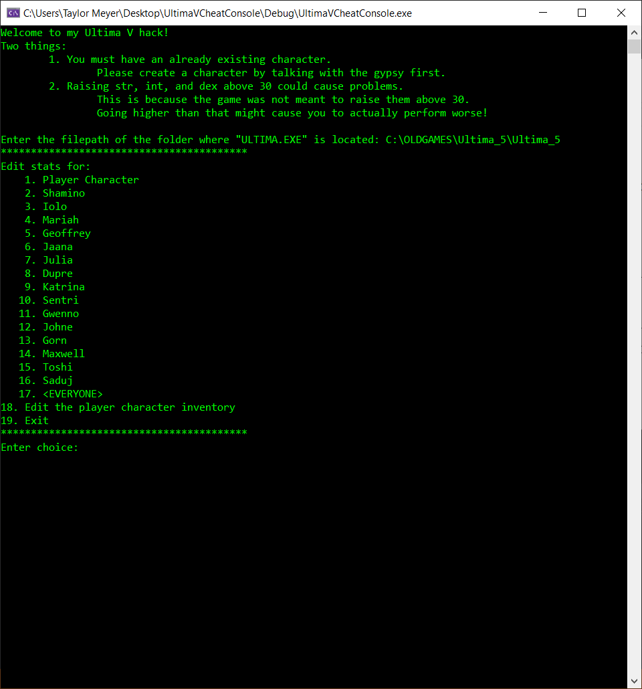
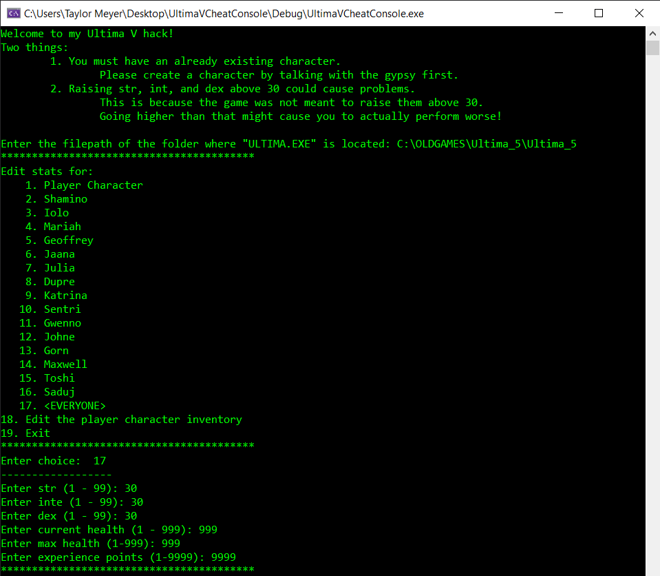
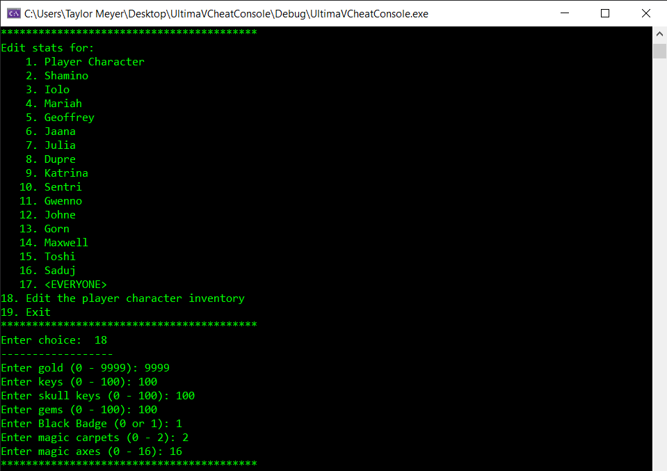
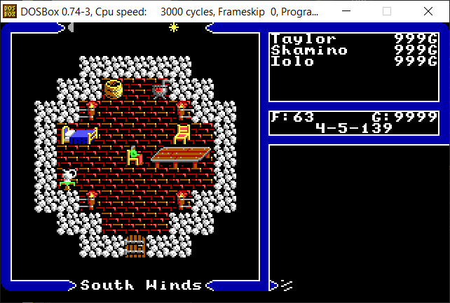
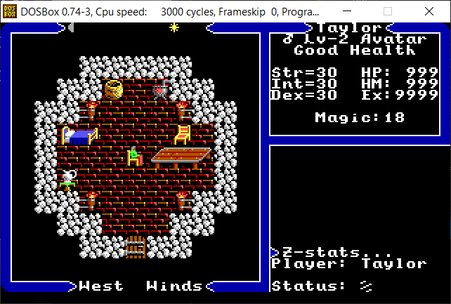

# Ultima V: Warriors of Destiny Cheat Console
This cheat console uses a command-line interface to ask the user which characters/party members they wish to edit the statistics for, such as current health, max health, gold, strength, etc. This is accomplished by editing the saved game file (SAVED.GAM located in the root folder).

Using a hex editor, I determined the offsets for where the values of various statistics were stored, as well as the inventory. The user can change any individual characters statistics, or all characters at once.

Written in C++.

## Images
Make sure to create a new character/savefile first.

Here is what the start of game looks like. Notice Shamino begins the game injured at 5hp.

Here we run the cheat console.

Now our characters are super powered!

